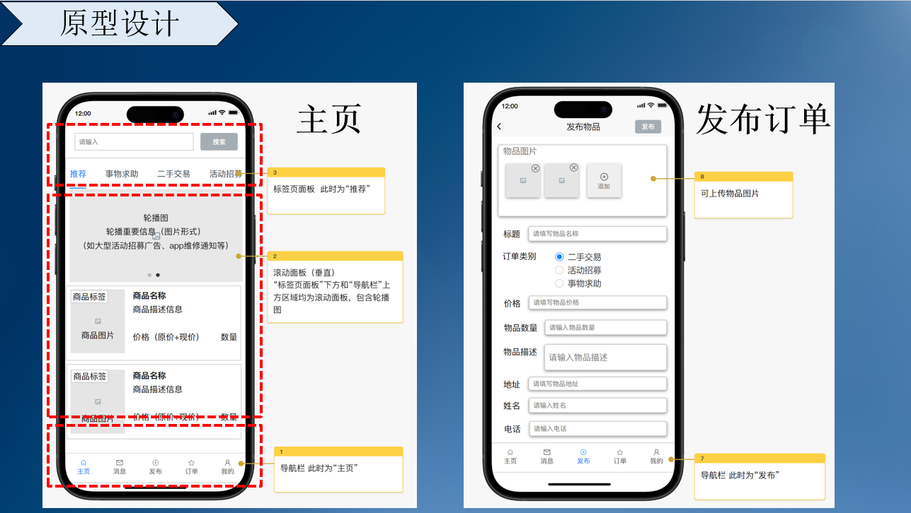
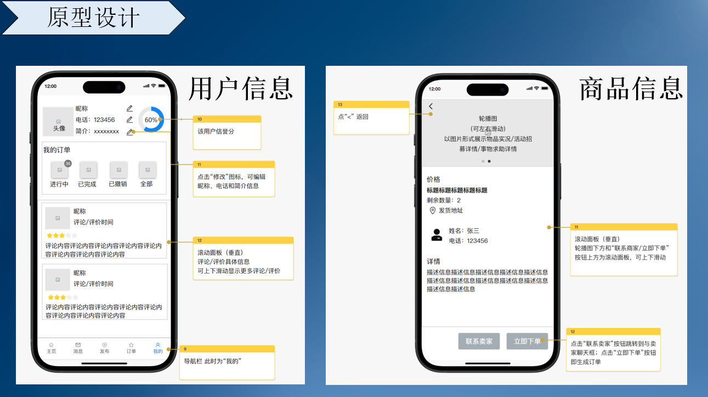
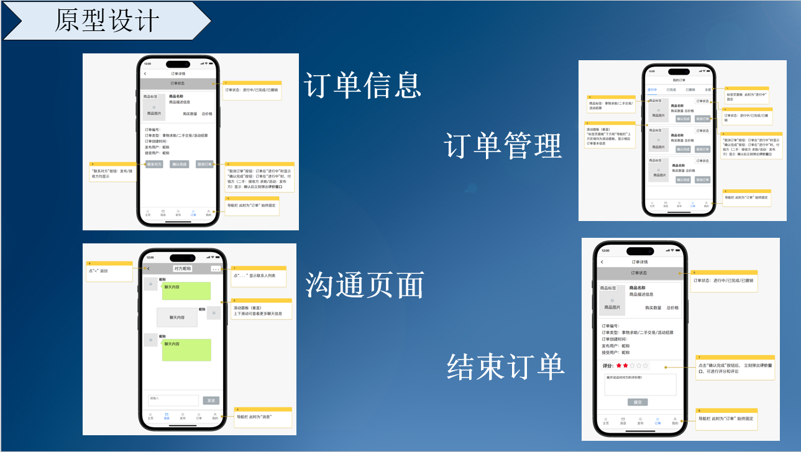
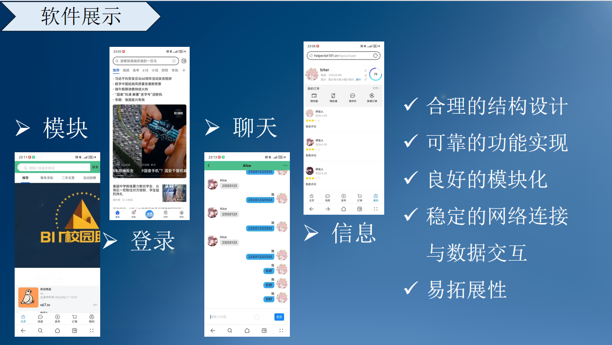
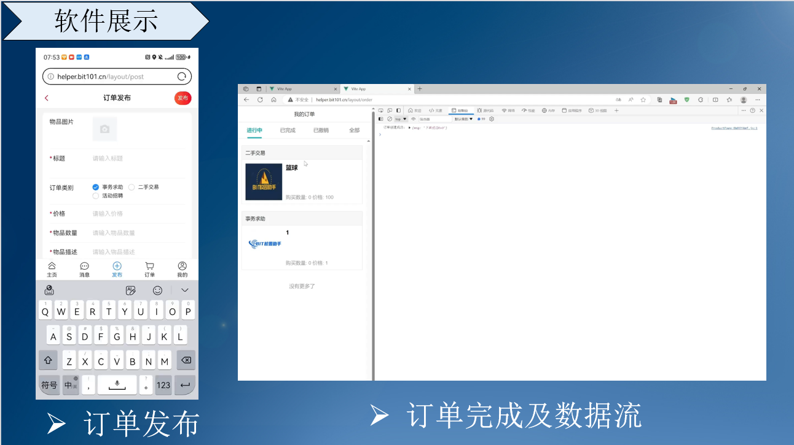

# **项目简介**

#### 项目介绍：

​	BIT课程项目，一款移动端校园互助平台。用户可以进行事务求助、二手交易和活动招募等操作，为用户建立一个高效、便捷、以方便同学为核心的校园服务平台。

#### 项目预览：











#### **项目运行：**

## Recommended IDE Setup

[VSCode](https://code.visualstudio.com/) + [Volar](https://marketplace.visualstudio.com/items?itemName=Vue.volar) (and disable Vetur).

## Customize configuration

See [Vite Configuration Reference](https://vitejs.dev/config/).

## Project Setup

```sh
pnpm install
```

### Compile and Hot-Reload for Development

```sh
pnpm dev
```

### Compile and Minify for Production

```sh
pnpm build
```

### Lint with [ESLint](https://eslint.org/)

```sh
pnpm lint
```
